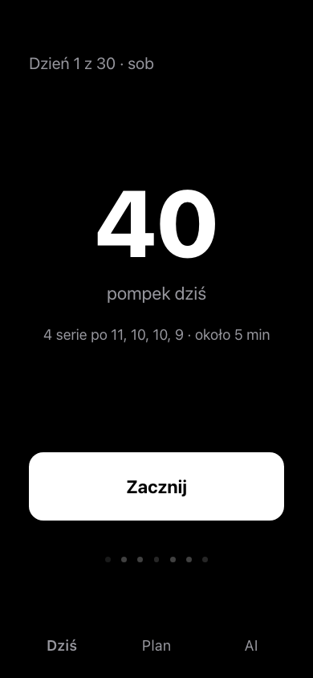
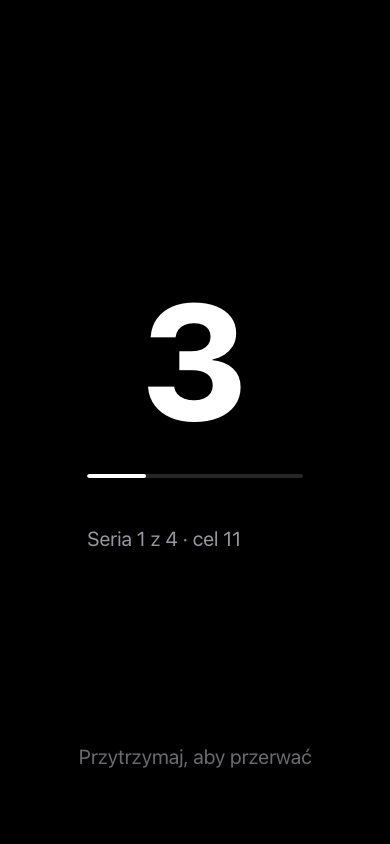
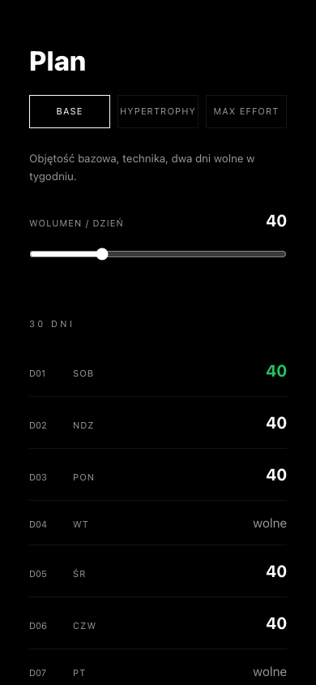

# PUSH — Push Pal

Minimalistyczna aplikacja do treningu pompek. Jeden ekran, jedna wielka liczba,
zero rozpraszaczy — powtórzenia liczy **prawdziwy czujnik telefonu** (Halla
albo zbliżeniowy), nie stoper i nie zgadywanie.

Estetyka: pełna czerń OLED, jeden zielony akcent, ostre kąty, `future tech
minimal`.

<table>
  <tr>
    <td></td>
    <td></td>
    <td></td>
  </tr>
  <tr>
    <td align="center"><sub>Dziś</sub></td>
    <td align="center"><sub>Trening</sub></td>
    <td align="center"><sub>Plan</sub></td>
  </tr>
</table>

## Jak to liczy pompki

Zamiast kamery czy akcelerometru, licznik korzysta z czujników, które telefon
już ma wbudowane:

- **Hall** (domyślny) — magnetometr telefonu (`Sensor.TYPE_MAGNETIC_FIELD`),
  czyli fizycznie tablica czujników Halla. Magnes w opasce na nadgarstku albo
  przyklejony do podłogi, przechodzący blisko telefonu w dolnej fazie pompki,
  zaburza pole magnetyczne — to klasyczna, sprzętowa metoda liczenia pompek
  czujnikiem Halla.
- **Zbliżeniowy** — sprzętowy czujnik zbliżeniowy (`Sensor.TYPE_PROXIMITY`),
  na wielu telefonach też fizycznie zbudowany na efekcie Halla/magnetycznym.
  Liczy z odległości ręki/klatki piersiowej od telefonu, bez magnesu.

Wybór i czułość ustawia się na ekranie **Plan → Czujnik**. Natywna wtyczka
Android (`android/.../repsensor/RepSensorPlugin.java`) strumieniuje surowy,
znormalizowany sygnał do JS w tej samej skali co symulacja webowa — cała
logika progu, tempa i stabilności (`useRepSensor`) jest więc identyczna
niezależnie od tego, czy dane pochodzą z prawdziwego czujnika, czy (w
przeglądarce, bez telefonu) z symulacji zastępczej.

## Ekrany

- **Dziś** (`/`) — data, cel dnia, jeden przycisk `Zacznij`, rządek 7 kropek
  z ostatnim tygodniem.
- **Trening** (`/session`) — pełny ekran, gigantyczna cyfra licznika, pasek
  postępu serii, automatyczna przerwa z odliczaniem. Dotknięcie
  pauzuje/wznawia, przytrzymanie przerywa sesję.
- **Plan** (`/plan`) — generator 30-dniowego planu (Base / Hypertrophy / Max
  Effort + wolumen startowy), ręczna edycja pojedynczych dni, kalibracja
  czujnika.
- **AI** (`/insights`) — podłączenie lokalnego modelu (np. Ollama pod
  `localhost:11434`) i analiza ostatniego tygodnia. Kontrakt (`AiAdvisor`) jest
  gotowy, dziś działa na deterministycznym mocku — patrz
  [`src/lib/ai-client.ts`](src/lib/ai-client.ts).

Stan (plan, historia, ustawienia czujnika) jest zapisywany w `localStorage`
(`src/lib/session-store.ts`) — przeżywa odświeżenie i restart aplikacji.

## Architektura

Ten sam kod źródłowy obsługuje dwa cele budowania:

| Cel | Wejście | Build | Wyjście | Do czego |
|---|---|---|---|---|
| Web (SSR) | `src/routes/*`, `src/start.ts` | `npm run build` | Cloudflare/nitro | strona synchronizowana z Lovable |
| Android (Capacitor) | `mobile/index.html` → `src/mobile-main.tsx` | `npm run build:mobile` | `dist-mobile/` (statyczne SPA) | APK |

Trasy (`src/routes/*.tsx`, TanStack Router) i cała logika (`src/lib`,
`src/hooks`, `src/components`) są wspólne. Różni się tylko punkt wejścia:
web renderuje je przez SSR (`@tanstack/react-start`, nitro/Cloudflare),
Android dostaje czyste, statyczne SPA bez serwera (`vite.mobile.config.ts`),
które Capacitor pakuje do WebView. Zobacz komentarz w
[`src/mobile-main.tsx`](src/mobile-main.tsx).

Czujnik ma tę samą warstwę abstrakcji po obu stronach —
[`RepSensorSource`](src/hooks/use-rep-sensor.ts): na Androidzie implementuje ją
natywna wtyczka Capacitor ([`src/lib/native-sensor.ts`](src/lib/native-sensor.ts)
+ [`RepSensorPlugin.java`](android/app/src/main/java/com/pushpal/app/repsensor/RepSensorPlugin.java)),
w przeglądarce — symulacja w `useRepSensor`.

## Uruchomienie (web)

```sh
npm i
npm run dev
```

## Budowanie APK (Android)

Wymagania: Android SDK + Java (zmienna `ANDROID_HOME` / `local.properties` w
`android/`).

```sh
npm run android:apk
```

To po kolei: buduje statyczne SPA (`build:mobile`), synchronizuje je do
projektu Android (`cap sync android`) i uruchamia Gradle
(`assembleDebug`). Gotowy plik ląduje w
`android/app/build/outputs/apk/debug/app-debug.apk`.

Żeby tylko zsynchronizować web bez budowania APK (np. przed otwarciem
projektu w Android Studio): `npm run android`.

## Struktura

```
src/
  routes/          trasy (TanStack Router) — dziś, trening, plan, AI
  components/       RepCounter, DayRow, PlanEditor, AiPanel, BottomNav, MiniStreak
  hooks/            useRepSensor — wspólna logika progu/tempa, symulacja lub realny czujnik
  lib/
    plan-30.ts       model i generator 30-dniowego planu
    session-store.ts  stan aplikacji (localStorage)
    ai-client.ts     kontrakt AiAdvisor + mock
    native-sensor.ts  most JS ↔ wtyczka Capacitor RepSensor
  mobile-main.tsx   punkt wejścia SPA dla Androida (bez SSR)
mobile/index.html   statyczny wpis budowany przez vite.mobile.config.ts
android/             projekt Capacitor/Gradle
  app/src/main/java/com/pushpal/app/repsensor/RepSensorPlugin.java   natywny czujnik
```

## Znane ograniczenia

- Czułość magnetometru (tryb Hall) zależy od siły magnesu i odległości —
  doestraja się suwakiem "Czułość" w **Plan → Czujnik**, nie ma jednej
  uniwersalnej wartości.
- Plan liczy 30 dni od pierwszego uruchomienia; po tym oknie ekran Dziś
  pokazuje dzień 1 (brak automatycznego odnowienia cyklu).
- Tylko Android — brak celu iOS (Capacitor by na to pozwolił, ale nie ma tu
  odpowiednika `RepSensorPlugin` w Swift).

---

<!-- LOVABLE:BEGIN -->
## Build with Lovable

Ten projekt korzysta z [Lovable](https://lovable.dev) do edycji makiet UI —
zmiany wprowadzone w edytorze Lovable trafiają wprost do tego repozytorium.
Logika (czujnik, plan, sesja, budowanie na Androida) jest już zaimplementowana
poza Lovable, w zwykłym kodzie w tym repo.
<!-- LOVABLE:END -->
